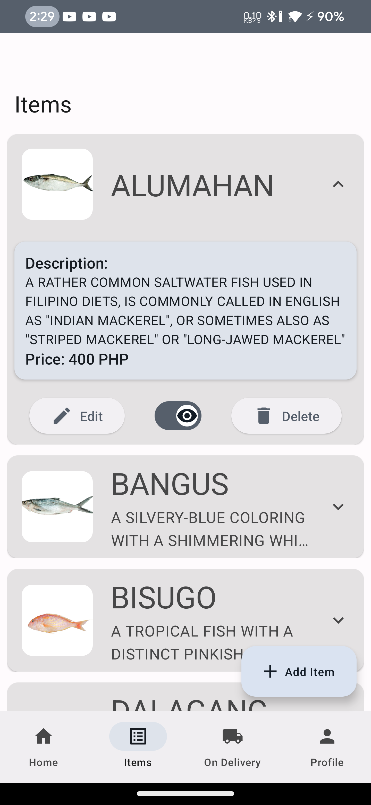
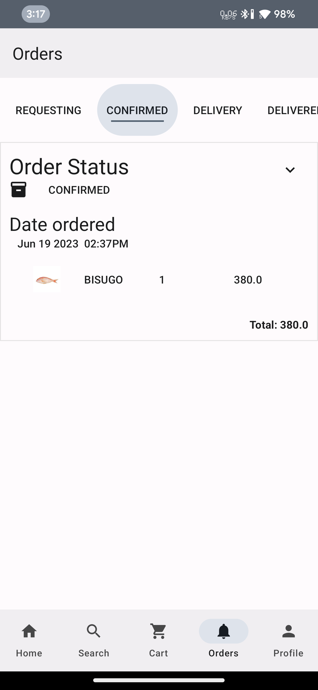

# Fishify-e-commerce
System documentation

## About
Fishify is a seafood E - Commerce for shopping online, built with jetpack compose and Firebase.

## Screenshots
Admin app / Fishify Manager

    
    
    

Client app / Fishify Manager

    
    
    
    

## Features
- Online shopping
- Secure authentication
- Tracks orders
- Recommends items 
- Tracks sales
  
## What Libraries used
Jetpack compose - ui builder
Is a modern way to build user interface along with Material UI Framework  
Firebase - online database 
An easy way to test a prototype with backend service with Firebase Firestore 
Material 3 UI
It follows design philosophies to create a better user experience
Coil compose - asynchronous image loader
To view image in very performant way
To reduce lag

## The developer’s development environment
Android studio flamingo 
Linux fedora 38
Android device with Custom Rom Android 13

##The Architecture pattern to make the application
MVVM ~ Model View ViewModel
Modern architecture for developing modern android applications
It provides abstraction function from business logic from user interface

## Github link
https://github.com/AyakashiKitsune/Fishify-e-commerce/
